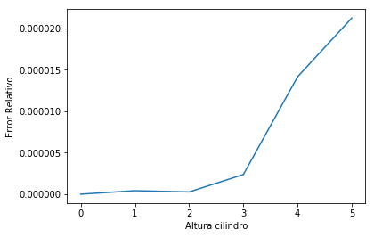

# MCOC-Proyecto-0
## **Este ejemplo**

En este ejemplo se tomo como funcion el volumen de un cilindro de radio 1 y altura variable con un valor inicial de 4.

Se formaron dos listas:

1. `f32` esta lista contiene numeros del tipo float32

2. `f64` esta lista contiene numeros del tipo float64

## **Resultados**

Se definio el error como:
error = abs(f64[i]-f32[i])
donde se tomo el valor absoluto de la resta de la lista f64 (numeros de largo float64) y la lista f32 (numeros de largo float32)

En el siguiente grafico se presenta como crece el error relativo a medida que aumenta la altura



**Output de la consola:**
````
Alt_f32: 4 Alt_f64: 4 Error: 0
Alt_f32: 12.56 Alt_f64: 12.56 Error: 4.196166987213701e-07
Alt_f32: 39.4384 Alt_f64: 39.4384 Error: 2.685546860448085e-07
Alt_f32: 123.83658 Alt_f64: 123.83657600000001 Error: 2.3691406170200935e-06
Alt_f32: 388.84686 Alt_f64: 388.84684864 Error: 1.415296873119587e-05

